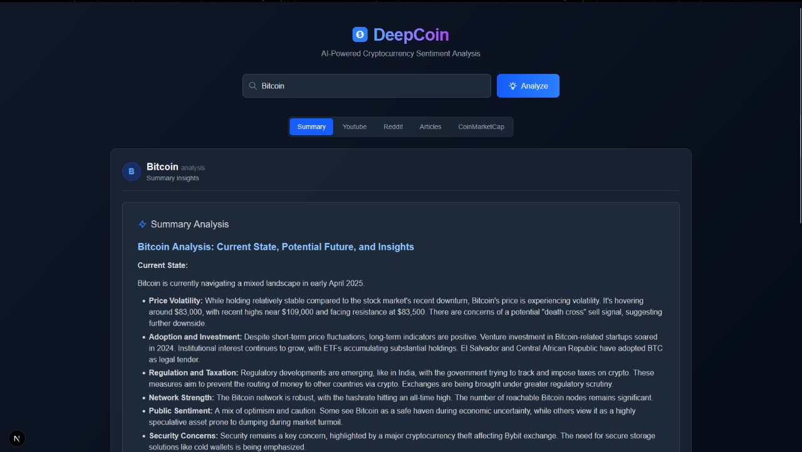
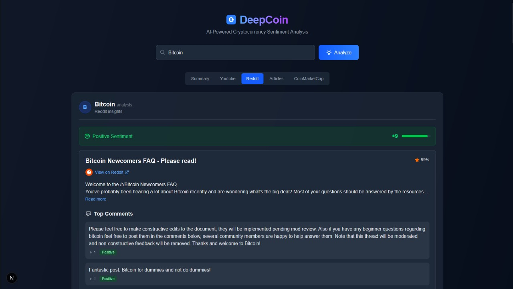
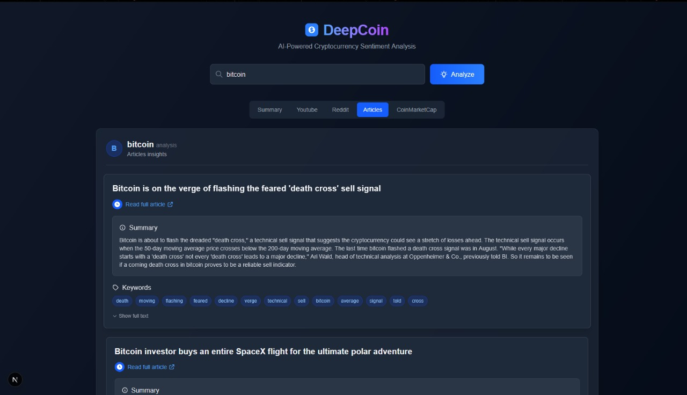
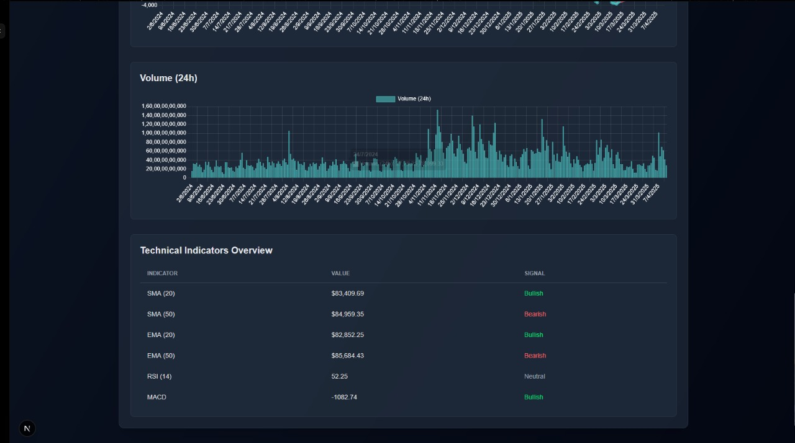
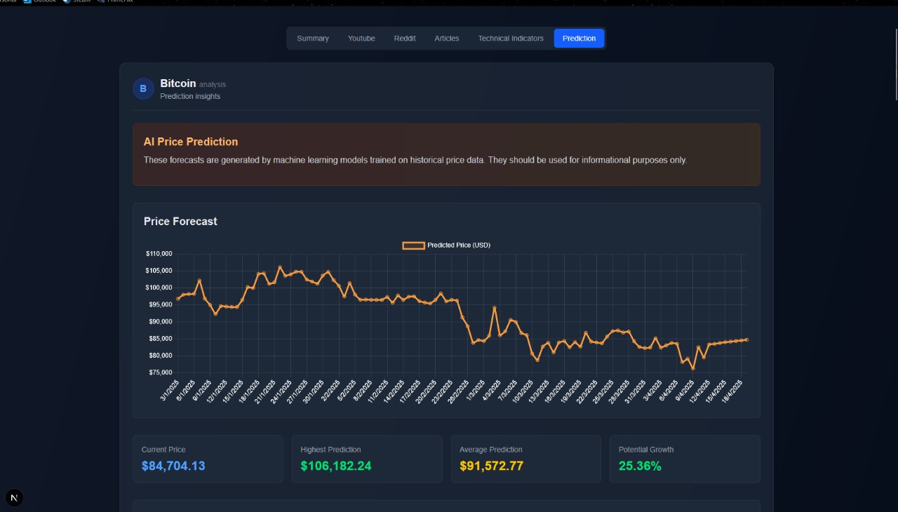

# DeepCoin

DeepCoin is an AI-powered cryptocurrency sentiment analysis platform that provides insights into the market trends, sentiment, and technical indicators of various cryptocurrencies. It leverages advanced natural language processing (NLP) and machine learning (ML) models to analyze data from multiple sources, including Reddit, YouTube, news articles, and historical market data.

## Problem Statement

Cryptocurrency markets are highly volatile and influenced by a variety of factors, including public sentiment, news, and technical indicators. Investors often struggle to make informed decisions due to the overwhelming amount of unstructured data available online. DeepCoin addresses this challenge by aggregating and analyzing data from multiple sources to provide actionable insights.

## Features

### 1. Sentiment Analysis
- **Reddit Sentiment**: Analyzes Reddit posts and comments to determine the overall sentiment of the community.
- **YouTube Sentiment**: Extracts and analyzes transcripts from YouTube videos to gauge sentiment.
- **News Sentiment**: Scrapes and summarizes news articles to provide sentiment insights.

### 2. Technical Indicators
- Provides key technical indicators such as SMA, EMA, RSI, MACD, and OBV for cryptocurrencies using historical market data.

### 3. Price Prediction
- Uses machine learning models to predict future cryptocurrency prices based on historical data.

### 4. Comprehensive Dashboard
- A user-friendly interface that displays sentiment analysis, technical indicators, and price predictions in an intuitive manner.

### 5. Data Sources
- Aggregates data from Reddit, YouTube, Google News, and CoinMarketCap.

## Screenshots

### Home Page


### Sentiment Analysis - YouTube


### Sentiment Analysis - Reddit


### Sentiment Analysis - News Articles


### Technical Indicators


### Technical Indicators Overview


### Price Prediction Using ML Model


## Future Scope

1. **Enhanced Prediction Models**:
   - Incorporate sentiment analysis data into the price prediction models to improve accuracy.
   - Use advanced deep learning techniques for better forecasting.

2. **Real-Time Data Integration**:
   - Add real-time data streaming for live updates on sentiment and market trends.

3. **Multi-Language Support**:
   - Extend sentiment analysis to support multiple languages for global coverage.

4. **Portfolio Management**:
   - Introduce features for users to manage and track their cryptocurrency portfolios.

5. **Mobile Application**:
   - Develop a mobile app for on-the-go access to insights and predictions.

## Getting Started

### Option 1: Manual Setup

#### Prerequisites
- Node.js (for the frontend)
- Python 3.12 (for the backend)

#### Installation

1. Clone the repository:
   ```bash
   git clone https://github.com/RUSHABHS1027/DeepCoin-Smart_Crypto_Sentiment_Analytics.git
   cd deepcoin
   ```

2. Set up the environment variables:
   - Copy the `.env.example` file to `.env` and fill in the required values.

3. Install dependencies:
   - Frontend:
     ```bash
     cd Frontend
     npm install
     ```
   - Backend:
     ```bash
     cd Backend
     pip install -r requirements.txt
     ```

4. Run the application:
   - Frontend:
     ```bash
     npm run dev
     ```
   - Backend:
     ```bash
     python main.py
     ```

5. Open the application in your browser:
   ```
   http://localhost:3000
   ```

---

### Option 2: Docker Setup

#### Prerequisites
- Docker
- Docker Compose

#### Steps

1. Clone the repository:
   ```bash
   git clone https://github.com/RUSHABHS1027/DeepCoin-Smart_Crypto_Sentiment_Analytics.git
   cd deepcoin
   ```

2. Set up the environment variables:
   - Copy the `.env.example` file to `.env` and fill in the required values.

3. Build and run the containers:
   ```bash
   docker-compose up --build
   ```

4. Open the application in your browser:
   ```
   http://localhost:3000
   ```

---

## Technologies Used

- **Frontend**: Next.js, React, Tailwind CSS
- **Backend**: Flask, PyTorch, Transformers
- **APIs**: CoinMarketCap, Google News, YouTube Data API, Reddit API
- **Machine Learning**: Sentiment analysis using FinBERT, price prediction using LSTM models

## License

This project is licensed under the MIT License. See the [LICENSE.md](LICENSE.md) file for details.
